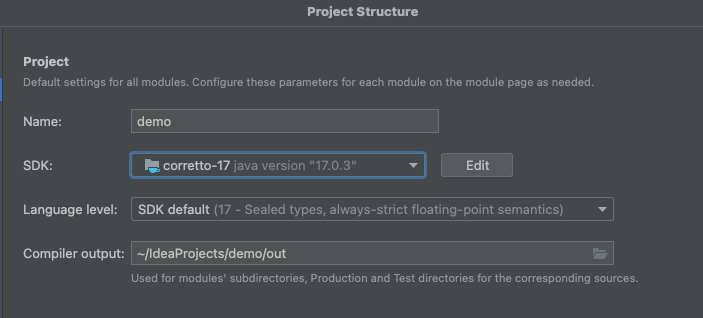

# Kotlin + Spring Boot + JPA
[Spring Boot + Kotlin + JPA 공식 가이드](https://spring.io/guides/tutorials/spring-boot-kotlin/) 내용 기반 
[따라하면서 실수했던 부분들 정리](https://velog.io/@wltn716/Kotlin-SpringBoot-JPA-%EA%B3%B5%EC%8B%9D%EB%AC%B8%EC%84%9C-%ED%8A%9C%ED%86%A0%EB%A6%AC%EC%96%BC-%EB%94%B0%EB%9D%BC%ED%95%A0-%EB%95%8C-%EC%A3%BC%EC%9D%98%ED%95%A0-%EC%A0%90)

## 사용 환경 및 Tool
* Kotlin 1.6.21
* jdk 17
* Spring Boot 2.7.1
* IntelliJ IDEA 2022.1 (Ultimate Edition)

## 설정
#### Amazon corretto 17
* File | ProjectStructure 에서 SDK Edit
* Amazon corretto 17 다운로드 후 설정

#### kapt
* Preferences | Build, Execution, Deployment | Compiler | Annotation Processors 창 열기
* enable annotation processing 체크

#### detekt
* Preferences | Plugins 에서 Detekt 설치

## 도커
#### 이미지 빌드
`./gradlew jib`
#### 컨테이너 실행
`docker run -p 8080:8080 jisoojung/kotlin-practice
`

